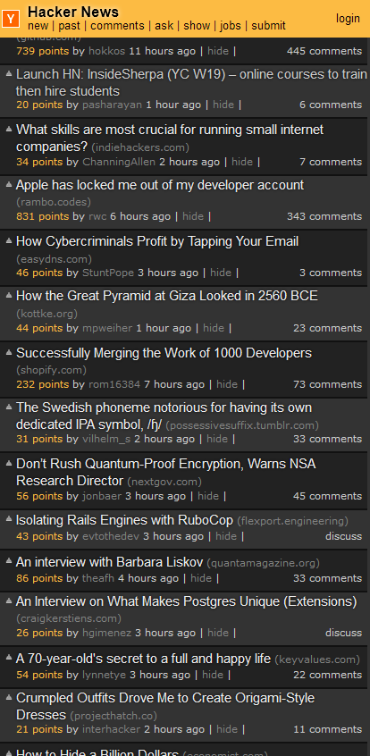
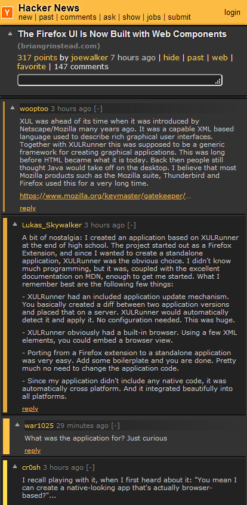
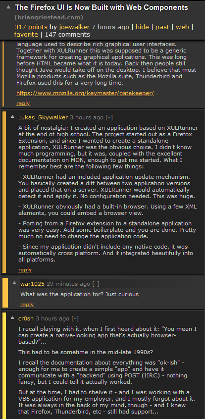
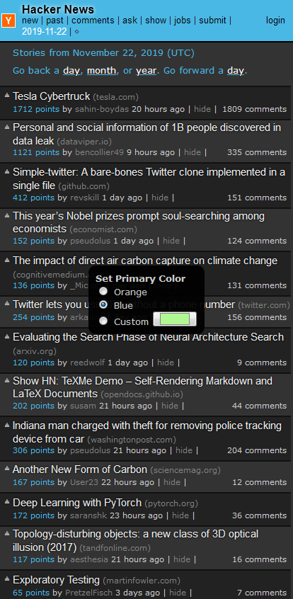

# Modern Night Theme for HackerNews
A modern night theme browser extension for HackerNews. Optimized for Mobile and Desktop. Originally made for a mobile replacement because native apps had some issue or another. The biggest issue this extension resolves (by simply being a browser extension for Firefox) is tab support, which is useful when wanting to come back to a page or comment section later. 

   

# License
MIT